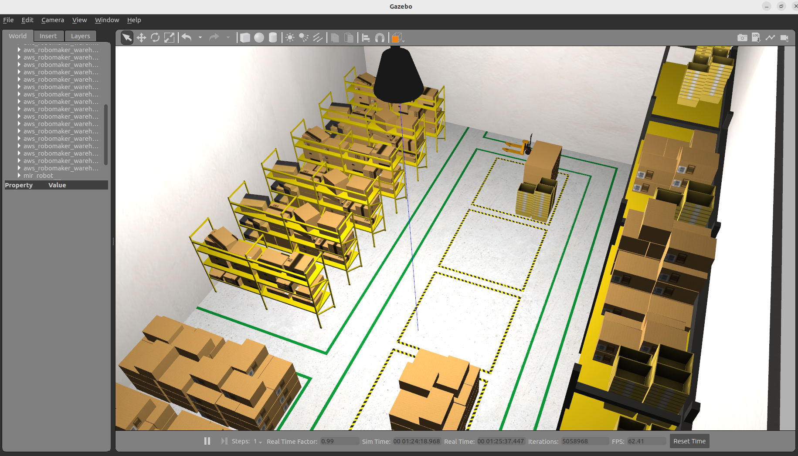
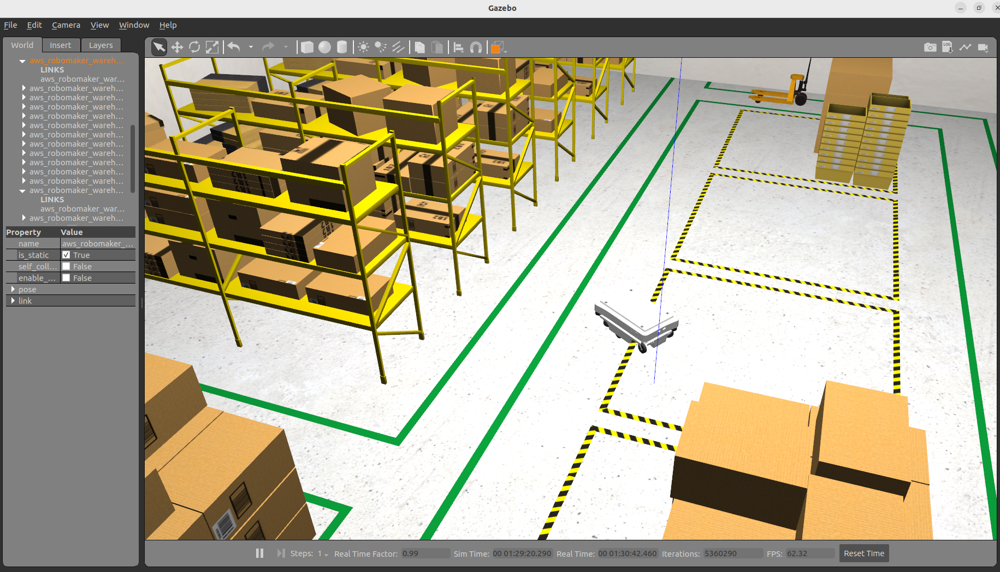

# Lecture 5 : SLAM and Navigation

This repository provides a comprehensive guide to setting up, building, and launching a `SLAM` and `Navigation` system using ROS2, `Gazebo`, and associated packages. Follow these steps to integrate the MIR robot into a warehouse world and apply advanced costmap filters.

## Overview
This demo covers:

- Building a ROS2 workspace.
- Cloning and building the MIR robot package.
- Launching Gazebo simulations.
- Integrating a warehouse world.
- Creating launch files for SLAM and Navigation.
- Applying costmap filters such as Keepout Zones.

## 1. Create Your Workspace

Run the following commands to create and initialize your ROS2 workspace:

``` bash
source /opt/ros/humble/setup.bash
mkdir -p ~/fra532_lecture5_ws/src
colcon build
source ~/fra532_lecture5_ws/install/setup.bash
```

To automatically source the workspace in every terminal, add this line to your `~/.bashrc`:

``` bash
echo "source ~/fra532_lecture5_ws/install/setup.bash" >> ~/.bashrc
```

## 2. Clone and Build the MIR Robot Package

Clone the MIR robot package into your workspace and install its dependencies:

``` bash
cd ~/fra532_lecture5_ws/

# Clone mir_robot into the ROS2 workspace
git clone -b humble-devel https://github.com/relffok/mir_robot src/mir_robot

# Fetch linked repositories using vcs
vcs import < src/mir_robot/ros2.repos src --recursive

# Install dependencies using rosdep (including ROS)
sudo apt update
sudo apt install -y python3-rosdep
rosdep update --rosdistro=humble
rosdep install --from-paths src --ignore-src -r -y --rosdistro humble

# Build all packages in the workspace
cd ~/fra532_lecture5_ws
colcon build
```

## 3. Launch the MIR Gazebo Simulation

Launch the MIR robot in Gazebo with the following command:

``` bash
ros2 launch mir_gazebo mir_gazebo_launch.py world:=maze rviz_config_file:=$(ros2 pkg prefix mir_navigation)/share/mir_navigation/rviz/mir_nav.rviz
```

## 4. Download and Build the Warehouse World
Clone and build the warehouse world package:

``` bash
cd
git clone https://github.com/aws-robotics/aws-robomaker-small-warehouse-world.git -b ros2

# Build for ROS2
cd ~/fra532_lecture5_ws
rosdep install --from-paths . --ignore-src -r -y
colcon build

# Run the warehouse world simulation
source install/setup.sh
ros2 launch aws_robomaker_small_warehouse_world small_warehouse.launch.py
```

## 5. Create a Package to Integrate the MIR Robot with the Warehouse World

Use the ROS2_pkg_cpp_py tool to generate new packages:

``` bash
# Clone ROS2_pkg_cpp_py into your workspace
cd
git clone https://github.com/tchoopojcharoen/ROS2_pkg_cpp_py.git

# Generate new packages (replace {YOUR_WORKSPACE} and {PACKAGE_NAME} as needed)
. ROS2_pkg_cpp_py/install_pkg.bash {YOUR_WORKSPACE} {PACKAGE_NAME}
. ROS2_pkg_cpp_py/install_pkg.bash ~/fra532_lecture5_ws fra532_nav
. ROS2_pkg_cpp_py/install_pkg.bash ~/fra532_lecture5_ws fra532_slam
. ROS2_pkg_cpp_py/install_pkg.bash ~/fra532_lecture5_ws fra532_gazebo
```

## 6. Create a Launch File for Gazebo

### In the `fra532_gazebo` Package
1. **Create a launch folder**.
2. **Edit the CMakeLists.txt** to include the launch folder in the installation section.
3. **Create the file** sim.launch.py inside the launch folder with the following content:

``` python
import os
from ament_index_python.packages import get_package_share_directory
from launch import LaunchDescription
from launch.actions import IncludeLaunchDescription
from launch.launch_description_sources import PythonLaunchDescriptionSource

def generate_launch_description():
    warehouse_pkg_dir = get_package_share_directory('aws_robomaker_small_warehouse_world')
    warehouse_launch_path = os.path.join(warehouse_pkg_dir, 'launch')
    warehouse_world_cmd = IncludeLaunchDescription(
        PythonLaunchDescriptionSource([warehouse_launch_path, '/no_roof_small_warehouse.launch.py'])
    )
    ld = LaunchDescription()
    ld.add_action(warehouse_world_cmd)
    return ld
```

Build and launch Simulation with:

``` bash
cd ~/fra532_lecture5_ws
colcon build && source install/setup.bash && ros2 launch fra532_gazebo sim.launch.py
```



3. **Add the MIR Robot to** sim.launch.py file:

``` python
import os

from ament_index_python.packages import get_package_share_directory
from launch import LaunchDescription
from launch.actions import IncludeLaunchDescription
from launch.launch_description_sources import PythonLaunchDescriptionSource

def generate_launch_description():
    warehouse_pkg_dir = get_package_share_directory('aws_robomaker_small_warehouse_world')
    warehouse_launch_path = os.path.join(warehouse_pkg_dir, 'launch')

    # Additional directories for the robot
    mir_description_dir = get_package_share_directory('mir_description')
    mir_gazebo_dir = get_package_share_directory('mir_gazebo')
    gazebo_ros_dir = get_package_share_directory('gazebo_ros')

    warehouse_world_cmd = IncludeLaunchDescription(
        PythonLaunchDescriptionSource([warehouse_launch_path, '/no_roof_small_warehouse.launch.py'])
    )

    # Spawn the robot in Gazebo
    spawn_robot = Node(
        package='gazebo_ros',
        executable='spawn_entity.py',
        arguments=['-entity', LaunchConfiguration('robot_name'),
                   '-topic', 'robot_description',
                   '-b'],  # Bond the node to the Gazebo model
        namespace=LaunchConfiguration('namespace'),
        output='screen'
    )

    ld = LaunchDescription()
    ld.add_action(warehouse_world_cmd)
    ld.add_action(spawn_robot)
    return ld
```

Build and launch Simulation (MIR Robot) with:

``` bash
cd ~/fra532_lecture5_ws
colcon build && source install/setup.bash && ros2 launch fra532_gazebo sim.launch.py
```



## 7. Create a Launch File for SLAM
In the `fra532_slam` Package
1. Create launch, rviz and config folders.
2. Edit the CMakeLists.txt to include these folders in the installation section.
3. Create the file slam.launch.py in the launch folder the following content:

``` python
import os
from launch import LaunchDescription
from launch.actions import DeclareLaunchArgument, IncludeLaunchDescription, OpaqueFunction, SetLaunchConfiguration
from launch.launch_description_sources import PythonLaunchDescriptionSource
from launch.conditions import IfCondition
from launch.substitutions import LaunchConfiguration
from ament_index_python.packages import get_package_share_directory

def generate_launch_description():
    mir_driver_dir = get_package_share_directory('mir_driver')
    mir_nav_dir = get_package_share_directory('mir_navigation')

    def declare_rviz_config(context):
        nav_enabled = context.launch_configurations['navigation_enabled']
        if nav_enabled == 'true':
            config_file = os.path.join(mir_nav_dir, 'rviz', 'mir_mapping_nav.rviz')
        else:
            config_file = os.path.join(mir_nav_dir, 'rviz', 'mir_mapping.rviz')
        return [SetLaunchConfiguration('rviz_config_file', config_file)]

    declare_use_sim_time_argument = DeclareLaunchArgument(
        'use_sim_time',
        default_value='false',
        description='Use simulation/Gazebo clock'
    )

    declare_slam_params_file_cmd = DeclareLaunchArgument(
        'slam_params_file',
        default_value=os.path.join(get_package_share_directory("mir_navigation"), 'config', 'mir_mapping_async.yaml'),
        description='Full path to the ROS2 parameters file for the slam_toolbox node'
    )

    declare_nav_argument = DeclareLaunchArgument(
        'navigation_enabled',
        default_value='false',
        description='Enable navigation during mapping'
    )

    declare_namespace_arg = DeclareLaunchArgument(
        'namespace',
        default_value='',
        description='Namespace to apply to all topics'
    )

    start_driver_cmd = IncludeLaunchDescription(
        PythonLaunchDescriptionSource(
            os.path.join(mir_driver_dir, 'launch', 'mir_launch.py')
        ),
        launch_arguments={'rviz_config_file': LaunchConfiguration('rviz_config_file')}.items()
    )

    launch_mapping = IncludeLaunchDescription(
        PythonLaunchDescriptionSource(
            os.path.join(mir_nav_dir, 'launch', 'include', 'mapping.py')
        ),
        launch_arguments=[
            ('use_sim_time', LaunchConfiguration('use_sim_time')),
            ('slam_params_file', LaunchConfiguration('slam_params_file'))
        ]
    )

    launch_navigation_if_enabled = IncludeLaunchDescription(
        PythonLaunchDescriptionSource(
            os.path.join(mir_nav_dir, 'launch', 'include', 'navigation.py')
        ),
        condition=IfCondition(LaunchConfiguration('navigation_enabled')),
        launch_arguments={'map_subscribe_transient_local': 'true'}.items()
    )

    ld = LaunchDescription()
    ld.add_action(declare_namespace_arg)
    ld.add_action(declare_use_sim_time_argument)
    ld.add_action(declare_nav_argument)
    ld.add_action(declare_slam_params_file_cmd)
    ld.add_action(OpaqueFunction(function=declare_rviz_config))
    ld.add_action(start_driver_cmd)
    ld.add_action(launch_mapping)
    ld.add_action(launch_navigation_if_enabled)
    return ld
```
4. Create the file mapping_async.yaml in the config folder with the following content:

``` bash
slam_toolbox:
  ros__parameters:
    # Plugin parameters
    solver_plugin: solver_plugins::CeresSolver
    ceres_linear_solver: SPARSE_NORMAL_CHOLESKY
    ceres_preconditioner: SCHUR_JACOBI
    ceres_trust_strategy: LEVENBERG_MARQUARDT
    ceres_dogleg_type: TRADITIONAL_DOGLEG
    ceres_loss_function: None

    # ROS parameters
    odom_frame: odom
    map_frame: map
    base_frame: base_footprint
    scan_topic: /scan
    mode: mapping  # Use 'localization' for localization mode

    # Uncomment and configure if continuing a map from a given pose or dock:
    # map_file_name: /path/to/map_file
    # map_start_pose: [0.0, 0.0, 0.0]
    # map_start_at_dock: true

    debug_logging: true
    throttle_scans: 1
    transform_publish_period: 0.02  # If 0, odometry is never published
    map_update_interval: 0.01
    resolution: 0.05
    max_laser_range: 20.0  # For rasterizing images
    minimum_time_interval: 0.5
    transform_timeout: 0.5
    tf_buffer_duration: 300.
    stack_size_to_use: 40000000  # Increased stack size for large maps
    enable_interactive_mode: true

    # General parameters
    use_scan_matching: true
    use_scan_barycenter: true
    minimum_travel_distance: 0.5
    minimum_travel_heading: 0.5
    scan_buffer_size: 10
    scan_buffer_maximum_scan_distance: 10.0
    link_match_minimum_response_fine: 0.1  
    link_scan_maximum_distance: 1.5
    loop_search_maximum_distance: 3.0
    do_loop_closing: true 
    loop_match_minimum_chain_size: 10           
    loop_match_maximum_variance_coarse: 3.0  
    loop_match_minimum_response_coarse: 0.35    
    loop_match_minimum_response_fine: 0.45

    # Correlation parameters
    correlation_search_space_dimension: 0.5
    correlation_search_space_resolution: 0.01
    correlation_search_space_smear_deviation: 0.1 

    # Loop closure parameters
    loop_search_space_dimension: 8.0
    loop_search_space_resolution: 0.05
    loop_search_space_smear_deviation: 0.03

    # Scan matcher parameters
    distance_variance_penalty: 0.5      
    angle_variance_penalty: 1.0    
    fine_search_angle_offset: 0.00349     
    coarse_search_angle_offset: 0.349   
    coarse_angle_resolution: 0.0349        
    minimum_angle_penalty: 0.9
    minimum_distance_penalty: 0.5
    use_response_expansion: true
```

Build and launch SLAM with:

``` bash
cd ~/fra532_lecture5_ws
colcon build && source install/setup.bash && ros2 launch fra532_slam mapping.launch.py
```

Watch the demonstration video below:

<video width="800" controls> <source src="media/slam.mp4" type="video/mp4"> Your browser does not support the video tag. </video>

## 8. Create a Launch File for Navigation

**In Your Navigation Package**
1. Create the folders: launch, config, and rviz.
2. Edit the CMakeLists.txt to include these folders in the installation section.
3. Create the file navigation.launch.py in the launch folder with content similar to the example below:

``` python
import os
from ament_index_python.packages import get_package_share_directory
from launch import LaunchDescription
from launch.actions import DeclareLaunchArgument, ExecuteProcess, IncludeLaunchDescription
from launch.conditions import IfCondition
from launch.launch_description_sources import PythonLaunchDescriptionSource
from launch.substitutions import LaunchConfiguration, PythonExpression
from launch_ros.actions import Node

def generate_launch_description():
    # Get the launch directories
    nav2_bringup_dir = get_package_share_directory('nav2_bringup')
    bringup_dir = get_package_share_directory('nav2_rosdevday_2021')
    robot_model_dir = get_package_share_directory('neo_simulation2')
    warehouse_dir = get_package_share_directory('aws_robomaker_small_warehouse_world')

    nav2_launch_dir = os.path.join(nav2_bringup_dir, 'launch')
    launch_dir = os.path.join(bringup_dir, 'launch')
    rviz_config_file = os.path.join(nav2_bringup_dir, 'rviz', 'nav2_default_view.rviz')

    # Launch configuration variables
    slam = LaunchConfiguration('slam')
    map_yaml_file = LaunchConfiguration('map')
    use_sim_time = LaunchConfiguration('use_sim_time')
    params_file = LaunchConfiguration('params_file')

    # Simulation-specific launch configuration variables
    use_simulator = LaunchConfiguration('use_simulator')
    use_rviz = LaunchConfiguration('use_rviz')
    headless = LaunchConfiguration('headless')
    world = LaunchConfiguration('world')
    urdf = LaunchConfiguration('urdf')

    # Declare launch arguments
    declare_slam_cmd = DeclareLaunchArgument(
        'slam',
        default_value='False',
        description='Whether to run SLAM'
    )

    declare_map_yaml_cmd = DeclareLaunchArgument(
        'map',
        default_value=os.path.join(warehouse_dir, 'maps', '005', 'map.yaml'),
        description='Full path to the map file to load'
    )

    declare_use_sim_time_cmd = DeclareLaunchArgument(
        'use_sim_time',
        default_value='true',
        description='Use the simulation (Gazebo) clock if true'
    )

    declare_params_file_cmd = DeclareLaunchArgument(
        'params_file',
        default_value=os.path.join(bringup_dir, 'params', 'basic_params.yaml'),
        description='Full path to the ROS2 parameters file for all launched nodes'
    )

    declare_use_simulator_cmd = DeclareLaunchArgument(
        'use_simulator',
        default_value='True',
        description='Whether to start the simulator'
    )

    declare_use_rviz_cmd = DeclareLaunchArgument(
        'use_rviz',
        default_value='True',
        description='Whether to start RVIZ'
    )

    declare_simulator_cmd = DeclareLaunchArgument(
        'headless',
        default_value='False',
        description='Whether to execute gzclient for the simulation frontend'
    )

    declare_world_cmd = DeclareLaunchArgument(
        'world',
        default_value=os.path.join(bringup_dir, 'worlds', 'industrial_sim.world'),
        description='Full path to the world model file to load'
    )

    declare_urdf_cmd = DeclareLaunchArgument(
        'urdf',
        default_value=os.path.join(robot_model_dir, 'robots', 'mp_400', 'mp_400.urdf'),
        description='Full path to the URDF file for the robot model'
    )

    # Actions
    start_gazebo_server_cmd = ExecuteProcess(
        condition=IfCondition(use_simulator),
        cmd=['gzserver', '-s', 'libgazebo_ros_factory.so', world],
        cwd=[warehouse_dir], output='screen'
    )

    start_gazebo_client_cmd = ExecuteProcess(
        condition=IfCondition(PythonExpression([use_simulator, ' and not ', headless])),
        cmd=['gzclient'],
        cwd=[warehouse_dir], output='screen'
    )

    spawn_entity_cmd = Node(
        package='gazebo_ros',
        executable='spawn_entity.py',
        arguments=['-entity', 'robot',
                   '-file', urdf,
                   '-x', '3.45',
                   '-y', '2.15',
                   '-z', '0.10',
                   '-Y', '3.14'],
        output='screen'
    )

    start_robot_state_publisher_cmd = Node(
        package='robot_state_publisher',
        executable='robot_state_publisher',
        name='robot_state_publisher',
        output='screen',
        parameters=[{'use_sim_time': use_sim_time}],
        arguments=[urdf]
    )

    rviz_cmd = IncludeLaunchDescription(
        PythonLaunchDescriptionSource(
            os.path.join(nav2_launch_dir, 'rviz_launch.py')
        ),
        condition=IfCondition(use_rviz),
        launch_arguments={'namespace': '',
                          'use_namespace': 'False',
                          'use_sim_time': use_sim_time,
                          'rviz_config': rviz_config_file}.items()
    )

    bringup_cmd = IncludeLaunchDescription(
        PythonLaunchDescriptionSource(
            os.path.join(nav2_launch_dir, 'bringup_launch.py')
        ),
        launch_arguments={'slam': slam,
                          'map': map_yaml_file,
                          'use_sim_time': use_sim_time,
                          'params_file': params_file,
                          'autostart': 'True'}.items()
    )

    ld = LaunchDescription()
    ld.add_action(declare_slam_cmd)
    ld.add_action(declare_map_yaml_cmd)
    ld.add_action(declare_use_sim_time_cmd)
    ld.add_action(declare_params_file_cmd)
    ld.add_action(declare_use_simulator_cmd)
    ld.add_action(declare_use_rviz_cmd)
    ld.add_action(declare_simulator_cmd)
    ld.add_action(declare_world_cmd)
    ld.add_action(declare_urdf_cmd)
    ld.add_action(start_gazebo_server_cmd)
    ld.add_action(start_gazebo_client_cmd)
    ld.add_action(spawn_entity_cmd)
    ld.add_action(start_robot_state_publisher_cmd)
    ld.add_action(rviz_cmd)
    ld.add_action(bringup_cmd)
    # Uncomment the following lines for the Keepout demo:
    # ld.add_action(start_lifecycle_manager_cmd)
    # ld.add_action(start_map_server_cmd)
    # ld.add_action(start_costmap_filter_info_server_cmd)
    return ld
```

Build and launch Navigation:

``` bash
cd ~/fra532_lecture5_ws
colcon build && source install/setup.bash && ros2 launch fra532_slam navigation.launch.py
```

## 9. Costmap Filters for a Full Application
In the previous demo, the robot navigated under shelving units and through safety-taped areas because it was small enough to do so. In real-world scenarios, such behavior might be unsafe or undesirable. To address this, you can apply the new Keepout Zones costmap filter.

**Keepout Mask**

A keepout mask is a file (similar to a map) that defines areas where the robot should avoid. It can designate strict no-go zones or assign higher traversal costs to certain regions. For this demo, a pre-generated keepout mask marks the safety tape areas and the space beneath shelves as no-go zones.

If needed, install an image editor like GIMP:

``` bash
sudo apt-get install gimp
```