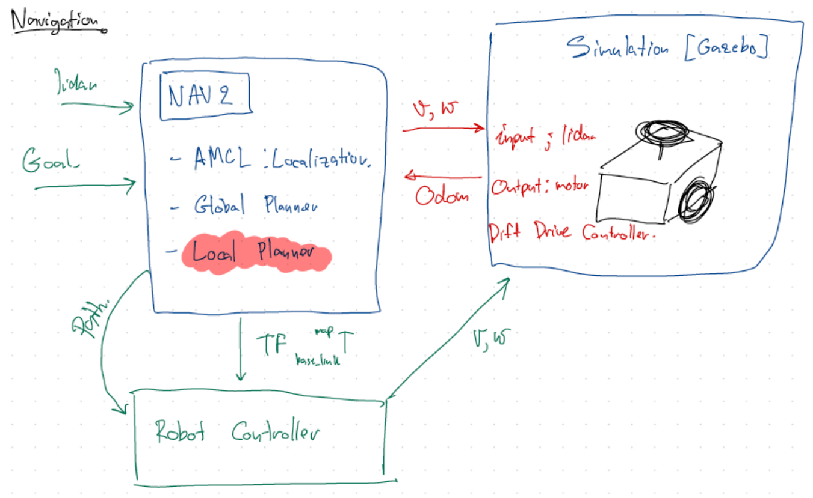
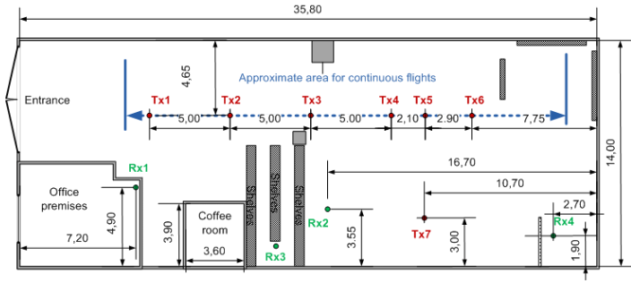
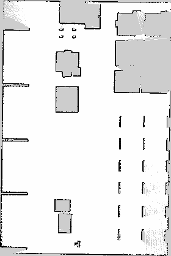
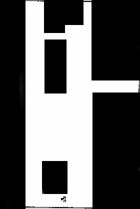
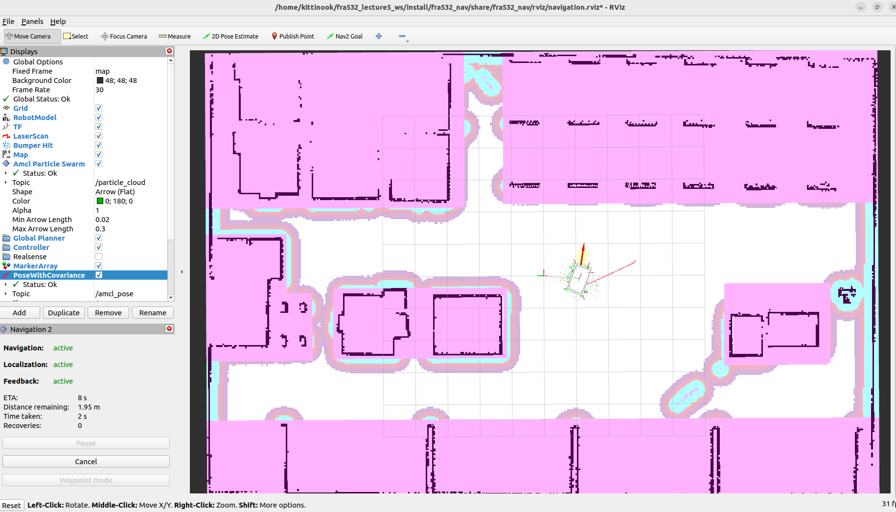

# Lecture 5 : SLAM and Navigation

This repository provides a comprehensive guide to setting up, building, and launching a `SLAM` and `Navigation` system using ROS2, `Gazebo`, and associated packages. Follow these steps to integrate the MIR robot into a warehouse world and apply advanced costmap filters.



## Credit
Configuration Guide : https://docs.nav2.org/configuration/index.html
ROS 2 Navigation Tuning Guide – Nav2 : https://automaticaddison.com/ros-2-navigation-tuning-guide-nav2
nav2_rosdevday_2021 (Old Version) : https://github.com/SteveMacenski/nav2_rosdevday_2021
Write an action server and client : https://docs.ros.org/en/humble/Tutorials/Intermediate/Writing-an-Action-Server-Client/Py.html

## Command
``` bash
killall -9 gzclient gzserver
```

## Overview

Nav2 is the next generation of the ROS Navigation Stack, offering an expanding suite of capabilities, algorithms, and features designed for both production and research applications.

This lecture covers:

- Building a ROS2 workspace.
- Cloning and building the MIR robot package.
- Launching Gazebo simulations.
- Integrating a warehouse world.
- Creating launch files for SLAM and Navigation.
- Applying costmap filters such as Keepout Zones.


## 1. Create Your Workspace

Run the following commands to create and initialize your ROS2 workspace:

``` bash
source /opt/ros/humble/setup.bash
mkdir -p ~/fra532_lecture5_ws/src
colcon build
source ~/fra532_lecture5_ws/install/setup.bash
```

To automatically source the workspace in every terminal, add this line to your `~/.bashrc`:

``` bash
echo "source ~/fra532_lecture5_ws/install/setup.bash" >> ~/.bashrc
```

## 2. Clone and Build the MIR Robot Package

Clone the MIR robot package into your workspace and install its dependencies:

``` bash
cd ~/fra532_lecture5_ws/

# Clone mir_robot into the ROS2 workspace
git clone -b humble-devel https://github.com/relffok/mir_robot src/mir_robot

# Fetch linked repositories using vcs
vcs import < src/mir_robot/ros2.repos src --recursive

# Install dependencies using rosdep (including ROS)
sudo apt update
sudo apt install -y python3-rosdep
rosdep update --rosdistro=humble
rosdep install --from-paths src --ignore-src -r -y --rosdistro humble

# Build all packages in the workspace
cd ~/fra532_lecture5_ws
colcon build
```

## 3. Launch the MIR Gazebo Simulation

Launch the MIR robot in Gazebo with the following command:

``` bash
ros2 launch mir_gazebo mir_gazebo_launch.py world:=maze rviz_config_file:=$(ros2 pkg prefix mir_navigation)/share/mir_navigation/rviz/mir_nav.rviz
```

## 4. Download and Build the Warehouse World
Clone and build the warehouse world package:

``` bash
cd
git clone https://github.com/aws-robotics/aws-robomaker-small-warehouse-world.git -b ros2

# Build for ROS2
cd ~/fra532_lecture5_ws
rosdep install --from-paths . --ignore-src -r -y
colcon build

# Run the warehouse world simulation
source install/setup.sh
ros2 launch aws_robomaker_small_warehouse_world small_warehouse.launch.py
```

## 5. Create a Package to Integrate the MIR Robot with the Warehouse World

Use the ROS2_pkg_cpp_py tool to generate new packages:

``` bash
# Clone ROS2_pkg_cpp_py into your workspace
cd
git clone https://github.com/tchoopojcharoen/ROS2_pkg_cpp_py.git

# Generate new packages (replace {YOUR_WORKSPACE} and {PACKAGE_NAME} as needed)
. ROS2_pkg_cpp_py/install_pkg.bash {YOUR_WORKSPACE} {PACKAGE_NAME}
. ROS2_pkg_cpp_py/install_pkg.bash ~/fra532_lecture5_ws fra532_nav
. ROS2_pkg_cpp_py/install_pkg.bash ~/fra532_lecture5_ws fra532_slam
. ROS2_pkg_cpp_py/install_pkg.bash ~/fra532_lecture5_ws fra532_gazebo
```

*** Try to create our world from this file



- Open Gazebo
- Edit > Building Editor > Import > map file
- Create Walls
- Add Features
- Add Texture
- Save as file

## 6. Create a Launch File for Gazebo

### In the `fra532_gazebo` Package
1. **Create a launch folder**.
2. **Edit the CMakeLists.txt** to include the launch folder in the installation section.
3. **Create the file** sim.launch.py inside the launch folder with the following content:

``` python
import os
from ament_index_python.packages import get_package_share_directory
from launch import LaunchDescription
from launch.actions import IncludeLaunchDescription
from launch.launch_description_sources import PythonLaunchDescriptionSource

def generate_launch_description():
    warehouse_pkg_dir = get_package_share_directory('aws_robomaker_small_warehouse_world')
    warehouse_launch_path = os.path.join(warehouse_pkg_dir, 'launch')
    warehouse_world_cmd = IncludeLaunchDescription(
        PythonLaunchDescriptionSource([warehouse_launch_path, '/no_roof_small_warehouse.launch.py'])
    )
    ld = LaunchDescription()
    ld.add_action(warehouse_world_cmd)
    return ld
```

Build and launch Simulation with:

``` bash
cd ~/fra532_lecture5_ws
colcon build && source install/setup.bash && ros2 launch fra532_gazebo sim.launch.py
```


3. **Add the MIR Robot to** sim.launch.py file:

``` python
import os

from ament_index_python.packages import get_package_share_directory
from launch import LaunchDescription
from launch.actions import IncludeLaunchDescription
from launch.launch_description_sources import PythonLaunchDescriptionSource

def generate_launch_description():
    warehouse_pkg_dir = get_package_share_directory('aws_robomaker_small_warehouse_world')
    warehouse_launch_path = os.path.join(warehouse_pkg_dir, 'launch')

    # Additional directories for the robot
    mir_description_dir = get_package_share_directory('mir_description')
    mir_gazebo_dir = get_package_share_directory('mir_gazebo')
    gazebo_ros_dir = get_package_share_directory('gazebo_ros')

    warehouse_world_cmd = IncludeLaunchDescription(
        PythonLaunchDescriptionSource([warehouse_launch_path, '/no_roof_small_warehouse.launch.py'])
    )

    # Spawn the robot in Gazebo
    spawn_robot = Node(
        package='gazebo_ros',
        executable='spawn_entity.py',
        arguments=['-entity', LaunchConfiguration('robot_name'),
                   '-topic', 'robot_description',
                   '-b'],  # Bond the node to the Gazebo model
        namespace=LaunchConfiguration('namespace'),
        output='screen'
    )

    ld = LaunchDescription()
    ld.add_action(warehouse_world_cmd)
    ld.add_action(spawn_robot)
    return ld
```

Build and launch Simulation (MIR Robot) with:

``` bash
cd ~/fra532_lecture5_ws
colcon build && source install/setup.bash && ros2 launch fra532_gazebo sim.launch.py
```


## 7. Create a Launch File for SLAM
In the `fra532_slam` Package
1. Create launch, rviz and config folders.
2. Edit the CMakeLists.txt to include these folders in the installation section.
3. Create the file slam.launch.py in the launch folder the following content:

``` python
import os
from launch import LaunchDescription
from launch.actions import DeclareLaunchArgument, IncludeLaunchDescription, OpaqueFunction, SetLaunchConfiguration
from launch.launch_description_sources import PythonLaunchDescriptionSource
from launch.conditions import IfCondition
from launch.substitutions import LaunchConfiguration
from ament_index_python.packages import get_package_share_directory

def generate_launch_description():
    mir_driver_dir = get_package_share_directory('mir_driver')
    mir_nav_dir = get_package_share_directory('mir_navigation')

    def declare_rviz_config(context):
        nav_enabled = context.launch_configurations['navigation_enabled']
        if nav_enabled == 'true':
            config_file = os.path.join(mir_nav_dir, 'rviz', 'mir_mapping_nav.rviz')
        else:
            config_file = os.path.join(mir_nav_dir, 'rviz', 'mir_mapping.rviz')
        return [SetLaunchConfiguration('rviz_config_file', config_file)]

    declare_use_sim_time_argument = DeclareLaunchArgument(
        'use_sim_time',
        default_value='false',
        description='Use simulation/Gazebo clock'
    )

    declare_slam_params_file_cmd = DeclareLaunchArgument(
        'slam_params_file',
        default_value=os.path.join(get_package_share_directory("mir_navigation"), 'config', 'mir_mapping_async.yaml'),
        description='Full path to the ROS2 parameters file for the slam_toolbox node'
    )

    declare_nav_argument = DeclareLaunchArgument(
        'navigation_enabled',
        default_value='false',
        description='Enable navigation during mapping'
    )

    declare_namespace_arg = DeclareLaunchArgument(
        'namespace',
        default_value='',
        description='Namespace to apply to all topics'
    )

    start_driver_cmd = IncludeLaunchDescription(
        PythonLaunchDescriptionSource(
            os.path.join(mir_driver_dir, 'launch', 'mir_launch.py')
        ),
        launch_arguments={'rviz_config_file': LaunchConfiguration('rviz_config_file')}.items()
    )

    launch_mapping = IncludeLaunchDescription(
        PythonLaunchDescriptionSource(
            os.path.join(mir_nav_dir, 'launch', 'include', 'mapping.py')
        ),
        launch_arguments=[
            ('use_sim_time', LaunchConfiguration('use_sim_time')),
            ('slam_params_file', LaunchConfiguration('slam_params_file'))
        ]
    )

    launch_navigation_if_enabled = IncludeLaunchDescription(
        PythonLaunchDescriptionSource(
            os.path.join(mir_nav_dir, 'launch', 'include', 'navigation.py')
        ),
        condition=IfCondition(LaunchConfiguration('navigation_enabled')),
        launch_arguments={'map_subscribe_transient_local': 'true'}.items()
    )

    ld = LaunchDescription()
    ld.add_action(declare_namespace_arg)
    ld.add_action(declare_use_sim_time_argument)
    ld.add_action(declare_nav_argument)
    ld.add_action(declare_slam_params_file_cmd)
    ld.add_action(OpaqueFunction(function=declare_rviz_config))
    ld.add_action(start_driver_cmd)
    ld.add_action(launch_mapping)
    ld.add_action(launch_navigation_if_enabled)
    return ld
```
4. Create the file mapping_async.yaml in the config folder with the following content:

``` bash
slam_toolbox:
  ros__parameters:
    # Plugin parameters
    solver_plugin: solver_plugins::CeresSolver
    ceres_linear_solver: SPARSE_NORMAL_CHOLESKY
    ceres_preconditioner: SCHUR_JACOBI
    ceres_trust_strategy: LEVENBERG_MARQUARDT
    ceres_dogleg_type: TRADITIONAL_DOGLEG
    ceres_loss_function: None

    # ROS parameters
    odom_frame: odom
    map_frame: map
    base_frame: base_footprint
    scan_topic: /scan
    mode: mapping  # Use 'localization' for localization mode

    # Uncomment and configure if continuing a map from a given pose or dock:
    # map_file_name: /path/to/map_file
    # map_start_pose: [0.0, 0.0, 0.0]
    # map_start_at_dock: true

    debug_logging: true
    throttle_scans: 1
    transform_publish_period: 0.02  # If 0, odometry is never published
    map_update_interval: 0.01
    resolution: 0.05
    max_laser_range: 20.0  # For rasterizing images
    minimum_time_interval: 0.5
    transform_timeout: 0.5
    tf_buffer_duration: 300.
    stack_size_to_use: 40000000  # Increased stack size for large maps
    enable_interactive_mode: true

    # General parameters
    use_scan_matching: true
    use_scan_barycenter: true
    minimum_travel_distance: 0.5
    minimum_travel_heading: 0.5
    scan_buffer_size: 10
    scan_buffer_maximum_scan_distance: 10.0
    link_match_minimum_response_fine: 0.1  
    link_scan_maximum_distance: 1.5
    loop_search_maximum_distance: 3.0
    do_loop_closing: true 
    loop_match_minimum_chain_size: 10           
    loop_match_maximum_variance_coarse: 3.0  
    loop_match_minimum_response_coarse: 0.35    
    loop_match_minimum_response_fine: 0.45

    # Correlation parameters
    correlation_search_space_dimension: 0.5
    correlation_search_space_resolution: 0.01
    correlation_search_space_smear_deviation: 0.1 

    # Loop closure parameters
    loop_search_space_dimension: 8.0
    loop_search_space_resolution: 0.05
    loop_search_space_smear_deviation: 0.03

    # Scan matcher parameters
    distance_variance_penalty: 0.5      
    angle_variance_penalty: 1.0    
    fine_search_angle_offset: 0.00349     
    coarse_search_angle_offset: 0.349   
    coarse_angle_resolution: 0.0349        
    minimum_angle_penalty: 0.9
    minimum_distance_penalty: 0.5
    use_response_expansion: true
```

Build and launch SLAM with:

``` bash
cd ~/fra532_lecture5_ws
colcon build && source install/setup.bash && ros2 launch fra532_slam mapping.launch.py
```

Watch the demonstration video below:

<video width="800" controls> <source src="media/slam.mp4" type="video/mp4"> Your browser does not support the video tag. </video>

5. Create the file save_map.launch.py in the launch folder with the following content:

``` python
from pathlib import Path
from launch_ros.actions.node import Node
from launch import LaunchDescription
from launch.actions import ExecuteProcess, RegisterEventHandler
from launch.event_handlers import OnProcessExit
from launch.substitutions import FindExecutable

def get_next_map_prefix(maps_dir: Path, base_name: str = "map"):
    """
    Check if a map file already exists (by looking for a .yaml file).
    If no map file is found, return the base file name.
    If a file exists, loop and append an incrementing number until an available file name is found.
    """
    candidate = maps_dir / base_name
    if not (candidate.with_suffix('.yaml')).exists():
        return str(candidate)
    counter = 1
    while (maps_dir / f"{base_name}_{counter}").with_suffix('.yaml').exists():
        counter += 1
    return str(maps_dir / f"{base_name}_{counter}")

def generate_launch_description():
    # Define the maps directory in the user's home folder
    maps_dir = Path.home() / "maps"
    # Create the maps directory if it does not exist
    maps_dir.mkdir(parents=True, exist_ok=True)
    
    # Get the next available map prefix to avoid overwriting an existing file
    next_map_prefix = get_next_map_prefix(maps_dir)

    # Launch an ExecuteProcess to create the maps directory (for compatibility with other launch actions)
    mkdir_maps = ExecuteProcess(
        cmd=[
            FindExecutable(name='mkdir'),
            ' -p ',
            str(maps_dir)
        ],
        shell=True
    )

    # Define the map_saver_cli node with the argument for the output file prefix
    map_saver_cli = Node(
        package='nav2_map_server',
        executable='map_saver_cli',
        name='map_saver_cli',
        output='screen',
        arguments=['-f', next_map_prefix],
        parameters=[{'save_map_timeout': 10000.0}]
    )

    # Register an event handler to launch map_saver_cli after mkdir_maps exits
    delay_map_saver_cli_after_mkdir_maps = RegisterEventHandler(
        event_handler=OnProcessExit(
            target_action=mkdir_maps,
            on_exit=[map_saver_cli]
        )
    )

    return LaunchDescription([
        mkdir_maps,
        delay_map_saver_cli_after_mkdir_maps
    ])
```

## 8. Create a Launch File for Navigation

**In Your Navigation Package**
1. Create the folders: launch, map, params and rviz.
2. Edit the CMakeLists.txt to include these folders in the installation section.
3. Create the file navigation.launch.py in the launch folder with content similar to the example below:

``` python
import os

from ament_index_python.packages import get_package_share_directory
from launch import LaunchDescription
from launch.actions import DeclareLaunchArgument, IncludeLaunchDescription
from launch.substitutions import LaunchConfiguration
from launch.launch_description_sources import PythonLaunchDescriptionSource
from launch_ros.actions import Node

def generate_launch_description():
    # Define the directory of the related package (Nav2 bringup)
    nav2_bringup_dir = get_package_share_directory('nav2_bringup')
    # Change the package name below to match your package that contains your map and parameter files
    my_nav_pkg_dir = get_package_share_directory('fra532_nav')
    
    # Define the paths to the configuration files
    rviz_config_file = os.path.join(my_nav_pkg_dir, 'rviz', 'navigation.rviz')
    map_yaml_file = os.path.join(my_nav_pkg_dir, 'maps', 'map.yaml')
    params_file = os.path.join(my_nav_pkg_dir, 'params', 'basic_params.yaml')
    
    # Create LaunchConfigurations for the arguments
    slam = LaunchConfiguration('slam')
    use_sim_time = LaunchConfiguration('use_sim_time')
    
    # Declare Launch Arguments
    declare_slam_cmd = DeclareLaunchArgument(
        'slam',
        default_value='False',
        description='Set to "True" to enable SLAM; "False" to use a pre-built map'
    )
    
    declare_use_sim_time_cmd = DeclareLaunchArgument(
        'use_sim_time',
        default_value='True',
        description='Use simulation time if true'
    )
    
    declare_map_yaml_cmd = DeclareLaunchArgument(
        'map',
        default_value=map_yaml_file,
        description='Full path to map file to load'
    )
    
    declare_params_file_cmd = DeclareLaunchArgument(
        'params_file',
        default_value=params_file,
        description='Full path to the ROS2 parameters file to use for all launched nodes'
    )
    
    # Include the nav2_bringup launch file which starts the main navigation nodes
    bringup_cmd = IncludeLaunchDescription(
        PythonLaunchDescriptionSource(os.path.join(nav2_bringup_dir, 'launch', 'bringup_launch.py')),
        launch_arguments={
            'slam': slam,
            'map': map_yaml_file,
            'use_sim_time': use_sim_time,
            'params_file': params_file,
            'autostart': 'True'
        }.items()
    )
    
    # Include the RViz launch for viewing navigation status (optional)
    rviz_cmd = IncludeLaunchDescription(
        PythonLaunchDescriptionSource(os.path.join(nav2_bringup_dir, 'launch', 'rviz_launch.py')),
        launch_arguments={
            'namespace': '',
            'use_sim_time': use_sim_time,
            'rviz_config': rviz_config_file
        }.items()
    )
    
    # UNCOMMENT HERE FOR KEEPOUT DEMO
    # Launch a node for the lifecycle manager to manage costmap filter nodes
    start_lifecycle_manager_cmd = Node(
            package='nav2_lifecycle_manager',
            executable='lifecycle_manager',
            name='lifecycle_manager_costmap_filters',
            output='screen',
            emulate_tty=True,
            parameters=[{'use_sim_time': use_sim_time},
                        {'autostart': True},
                        {'node_names': ['filter_mask_server', 'costmap_filter_info_server']}]
    )

    # Launch a node for the map server (filter mask server)
    start_map_server_cmd = Node(
            package='nav2_map_server',
            executable='map_server',
            name='filter_mask_server',
            output='screen',
            emulate_tty=True,
            parameters=[params_file]
    )

    # Launch a node for the costmap filter info server
    start_costmap_filter_info_server_cmd = Node(
            package='nav2_map_server',
            executable='costmap_filter_info_server',
            name='costmap_filter_info_server',
            output='screen',
            emulate_tty=True,
            parameters=[params_file]
    )
    
    # Create the launch description and add all actions
    ld = LaunchDescription()
    ld.add_action(declare_slam_cmd)
    ld.add_action(declare_use_sim_time_cmd)
    ld.add_action(declare_map_yaml_cmd)
    ld.add_action(declare_params_file_cmd)
    ld.add_action(bringup_cmd)
    ld.add_action(rviz_cmd)

    # UNCOMMENT HERE FOR KEEPOUT DEMO: add the nodes for costmap filtering
    # ld.add_action(start_lifecycle_manager_cmd)
    # ld.add_action(start_map_server_cmd)
    # ld.add_action(start_costmap_filter_info_server_cmd)
    
    return ld


```
4. Create the file basic_params.yaml in the params folder with the following content:

```bash
amcl:
  ros__parameters:
    use_sim_time: True
    alpha1: 0.2
    alpha2: 0.2
    alpha3: 0.2
    alpha4: 0.2
    alpha5: 0.2
    base_frame_id: "base_footprint"
    beam_skip_distance: 0.5
    beam_skip_error_threshold: 0.9
    beam_skip_threshold: 0.3
    do_beamskip: false
    global_frame_id: "map"
    lambda_short: 0.1
    laser_likelihood_max_dist: 2.0
    laser_max_range: 100.0
    laser_min_range: -1.0
    laser_model_type: "likelihood_field"
    max_beams: 60
    max_particles: 2000
    min_particles: 500
    odom_frame_id: "odom"
    pf_err: 0.05
    pf_z: 0.99
    recovery_alpha_fast: 0.0
    recovery_alpha_slow: 0.0
    resample_interval: 1
    robot_model_type: "nav2_amcl::DifferentialMotionModel"
    save_pose_rate: 0.5
    sigma_hit: 0.2
    tf_broadcast: true
    transform_tolerance: 2.0
    update_min_a: 0.2
    update_min_d: 0.25
    z_hit: 0.5
    z_max: 0.05
    z_rand: 0.5
    z_short: 0.05
    scan_topic: scan

bt_navigator:
  ros__parameters:
    use_sim_time: True
    global_frame: map
    robot_base_frame: base_link
    odom_topic: /odom
    bt_loop_duration: 10
    default_server_timeout: 20
    # 'default_nav_through_poses_bt_xml' and 'default_nav_to_pose_bt_xml' are use defaults:
    # nav2_bt_navigator/navigate_to_pose_w_replanning_and_recovery.xml
    # nav2_bt_navigator/navigate_through_poses_w_replanning_and_recovery.xml
    # They can be set here or via a RewrittenYaml remap from a parent launch file to Nav2.
    #
    # Note: Not quite correct, params that are not mentioned can not be substituted!
    plugin_lib_names:
    - nav2_compute_path_to_pose_action_bt_node
    - nav2_compute_path_through_poses_action_bt_node
    - nav2_smooth_path_action_bt_node
    - nav2_follow_path_action_bt_node
    - nav2_spin_action_bt_node
    - nav2_wait_action_bt_node
    - nav2_assisted_teleop_action_bt_node
    - nav2_back_up_action_bt_node
    - nav2_drive_on_heading_bt_node
    - nav2_clear_costmap_service_bt_node
    - nav2_is_stuck_condition_bt_node
    - nav2_goal_reached_condition_bt_node
    - nav2_goal_updated_condition_bt_node
    - nav2_globally_updated_goal_condition_bt_node
    - nav2_is_path_valid_condition_bt_node
    - nav2_initial_pose_received_condition_bt_node
    - nav2_reinitialize_global_localization_service_bt_node
    - nav2_rate_controller_bt_node
    - nav2_distance_controller_bt_node
    - nav2_speed_controller_bt_node
    - nav2_truncate_path_action_bt_node
    - nav2_truncate_path_local_action_bt_node
    - nav2_goal_updater_node_bt_node
    - nav2_recovery_node_bt_node
    - nav2_pipeline_sequence_bt_node
    - nav2_round_robin_node_bt_node
    - nav2_transform_available_condition_bt_node
    - nav2_time_expired_condition_bt_node
    - nav2_path_expiring_timer_condition
    - nav2_distance_traveled_condition_bt_node
    - nav2_single_trigger_bt_node
    - nav2_goal_updated_controller_bt_node
    - nav2_is_battery_low_condition_bt_node
    - nav2_navigate_through_poses_action_bt_node
    - nav2_navigate_to_pose_action_bt_node
    - nav2_remove_passed_goals_action_bt_node
    - nav2_planner_selector_bt_node
    - nav2_controller_selector_bt_node
    - nav2_goal_checker_selector_bt_node
    - nav2_controller_cancel_bt_node
    - nav2_path_longer_on_approach_bt_node
    - nav2_wait_cancel_bt_node
    - nav2_spin_cancel_bt_node
    - nav2_back_up_cancel_bt_node
    - nav2_assisted_teleop_cancel_bt_node
    - nav2_drive_on_heading_cancel_bt_node

bt_navigator_navigate_through_poses_rclcpp_node:
  ros__parameters:
    use_sim_time: True

bt_navigator_navigate_to_pose_rclcpp_node:
  ros__parameters:
    use_sim_time: True

controller_server:
  ros__parameters:
    use_sim_time: True
    controller_frequency: 20.0
    min_x_velocity_threshold: 0.001
    min_y_velocity_threshold: 0.5
    min_theta_velocity_threshold: 0.001
    failure_tolerance: 0.1
    progress_checker_plugin: "progress_checker"
    goal_checker_plugins: ["general_goal_checker"] # "precise_goal_checker"
    controller_plugins: ["FollowPath"]

    # Progress checker parameters
    progress_checker:
      plugin: "nav2_controller::SimpleProgressChecker"
      required_movement_radius: 0.5
      movement_time_allowance: 10.0
    # Goal checker parameters
    #precise_goal_checker:
    #  plugin: "nav2_controller::SimpleGoalChecker"
    #  xy_goal_tolerance: 0.25
    #  yaw_goal_tolerance: 0.25
    #  stateful: True
    general_goal_checker:
      stateful: True
      plugin: "nav2_controller::SimpleGoalChecker"
      xy_goal_tolerance: 0.25
      yaw_goal_tolerance: 0.25
    # DWB parameters
    FollowPath:
      plugin: "dwb_core::DWBLocalPlanner"
      debug_trajectory_details: True
      min_vel_x: 0.0
      min_vel_y: 0.0
      max_vel_x: 0.26
      max_vel_y: 0.0
      max_vel_theta: 1.0
      min_speed_xy: 0.0
      max_speed_xy: 0.26
      min_speed_theta: 0.0
      acc_lim_x: 2.5
      acc_lim_y: 0.0
      acc_lim_theta: 3.2
      decel_lim_x: -2.5
      decel_lim_y: 0.0
      decel_lim_theta: -3.2
      vx_samples: 20
      vy_samples: 5
      vtheta_samples: 20
      sim_time: 1.7
      linear_granularity: 0.05
      angular_granularity: 0.025
      transform_tolerance: 0.2
      xy_goal_tolerance: 0.25
      trans_stopped_velocity: 0.25
      short_circuit_trajectory_evaluation: True
      stateful: True
      critics: ["RotateToGoal", "Oscillation", "BaseObstacle", "GoalAlign", "PathAlign", "PathDist", "GoalDist", "ObstacleFootprint"]
      BaseObstacle.scale: 0.02
      PathAlign.scale: 32.0
      PathAlign.forward_point_distance: 0.1
      GoalAlign.scale: 24.0
      GoalAlign.forward_point_distance: 0.1
      PathDist.scale: 32.0
      GoalDist.scale: 24.0
      RotateToGoal.scale: 24.0
      RotateToGoal.slowing_factor: 5.0
      RotateToGoal.lookahead_time: -1.0

local_costmap:
  local_costmap:
    ros__parameters:
      update_frequency: 5.0
      publish_frequency: 2.0
      global_frame: odom
      robot_base_frame: base_link
      use_sim_time: True
      rolling_window: true
      width: 3
      height: 3
      resolution: 0.05
      # offset: front / back from base_link
      # footprint: '[ [front, width/2], [back, width/2], [-back, -width/2], [front, -width/2] ]'
      footprint: '[ [0.5, 0.25], [-0.4, 0.25], [-0.4, -0.25], [0.5, -0.25] ]'
      footprint_padding: 0.01
      plugins: ["voxel_layer", "inflation_layer"]
      inflation_layer:
        plugin: "nav2_costmap_2d::InflationLayer"
        cost_scaling_factor: 3.0
        inflation_radius: 0.55
      voxel_layer:
        plugin: "nav2_costmap_2d::VoxelLayer"
        enabled: True
        publish_voxel_map: True
        origin_z: 0.0
        z_resolution: 0.05
        z_voxels: 16
        max_obstacle_height: 2.0
        mark_threshold: 0
        observation_sources: scan
        scan:
          topic: /scan
          max_obstacle_height: 2.0
          clearing: True
          marking: True
          data_type: "LaserScan"
          raytrace_max_range: 3.0
          raytrace_min_range: 0.0
          obstacle_max_range: 2.5
          obstacle_min_range: 0.0
      static_layer:
        plugin: "nav2_costmap_2d::StaticLayer"
        map_subscribe_transient_local: True
      always_send_full_costmap: True

global_costmap:
  global_costmap:
    ros__parameters:
      update_frequency: 1.0
      publish_frequency: 1.0
      global_frame: map
      robot_base_frame: base_link
      use_sim_time: True
      # offset: front / back from base_link
      # footprint: '[ [front, width/2], [back, width/2], [-back, -width/2], [front, -width/2] ]'
      footprint: '[ [0.5, 0.25], [-0.4, 0.25], [-0.4, -0.25], [0.5, -0.25] ]'
      footprint_padding: 0.01
      resolution: 0.05
      track_unknown_space: true
      plugins: ["static_layer", "obstacle_layer", "inflation_layer"]
      filters: ["keepout_filter"] # UNCOMMENT HERE FOR KEEPOUT DEMO
      keepout_filter:
        plugin: "nav2_costmap_2d::KeepoutFilter"
        enabled: True
        filter_info_topic: "/costmap_filter_info"
      obstacle_layer:
        plugin: "nav2_costmap_2d::ObstacleLayer"
        enabled: True
        observation_sources: scan
        scan:
          topic: /scan
          max_obstacle_height: 2.0
          clearing: True
          marking: True
          data_type: "LaserScan"
          raytrace_max_range: 3.0
          raytrace_min_range: 0.0
          obstacle_max_range: 2.5
          obstacle_min_range: 0.0
      static_layer:
        plugin: "nav2_costmap_2d::StaticLayer"
        map_subscribe_transient_local: True
      inflation_layer:
        plugin: "nav2_costmap_2d::InflationLayer"
        cost_scaling_factor: 3.0
        inflation_radius: 0.55
      always_send_full_costmap: True

map_server:
  ros__parameters:
    use_sim_time: True
    # Overridden in launch by the "map" launch configuration or provided default value.
    # To use in yaml, remove the default "map" value in the tb3_simulation_launch.py file & provide full path to map below.
    yaml_filename: ""

map_saver:
  ros__parameters:
    use_sim_time: True
    save_map_timeout: 5.0
    free_thresh_default: 0.25
    occupied_thresh_default: 0.65
    map_subscribe_transient_local: True

planner_server:
  ros__parameters:
    expected_planner_frequency: 20.0
    use_sim_time: True
    planner_plugins: ["GridBased"]
    GridBased:
      plugin: "nav2_navfn_planner/NavfnPlanner"
      tolerance: 0.5
      use_astar: false
      allow_unknown: true

smoother_server:
  ros__parameters:
    use_sim_time: True
    smoother_plugins: ["simple_smoother"]
    simple_smoother:
      plugin: "nav2_smoother::SimpleSmoother"
      tolerance: 1.0e-10
      max_its: 1000
      do_refinement: True

behavior_server:
  ros__parameters:
    costmap_topic: local_costmap/costmap_raw
    footprint_topic: local_costmap/published_footprint
    cycle_frequency: 10.0
    behavior_plugins: ["spin", "backup", "drive_on_heading", "assisted_teleop", "wait"]
    spin:
      plugin: "nav2_behaviors/Spin"
    backup:
      plugin: "nav2_behaviors/BackUp"
    drive_on_heading:
      plugin: "nav2_behaviors/DriveOnHeading"
    wait:
      plugin: "nav2_behaviors/Wait"
    assisted_teleop:
      plugin: "nav2_behaviors/AssistedTeleop"
    global_frame: odom
    robot_base_frame: base_link
    transform_tolerance: 0.1
    use_sim_time: true
    simulate_ahead_time: 2.0
    max_rotational_vel: 0.5
    min_rotational_vel: 0.4
    rotational_acc_lim: 3.2

robot_state_publisher:
  ros__parameters:
    use_sim_time: True

waypoint_follower:
  ros__parameters:
    use_sim_time: True
    loop_rate: 20
    stop_on_failure: false
    waypoint_task_executor_plugin: "wait_at_waypoint"
    wait_at_waypoint:
      plugin: "nav2_waypoint_follower::WaitAtWaypoint"
      enabled: True
      waypoint_pause_duration: 200

velocity_smoother:
  ros__parameters:
    use_sim_time: True
    smoothing_frequency: 20.0
    scale_velocities: False
    feedback: "OPEN_LOOP"
    max_velocity: [0.26, 0.0, 1.0]
    min_velocity: [-0.26, 0.0, -1.0]
    max_accel: [2.5, 0.0, 3.2]
    max_decel: [-2.5, 0.0, -3.2]
    odom_topic: "odom"
    odom_duration: 0.1
    deadband_velocity: [0.0, 0.0, 0.0]
    velocity_timeout: 1.0

# UNCOMMENT HERE FOR KEEPOUT DEMO
costmap_filter_info_server:
  ros__parameters:
    use_sim_time: true
    type: 0
    filter_info_topic: "/costmap_filter_info"
    mask_topic: "/keepout_filter_mask"
    base: 0.0
    multiplier: 1.0

filter_mask_server:
  ros__parameters:
    use_sim_time: true
    frame_id: "map"
    topic_name: "/keepout_filter_mask"
    yaml_filename: "/home/kittinook/fra532_lecture5_ws/src/fra532_nav/maps/map_nav.yaml"

```

Build and launch Navigation:

``` bash
cd ~/fra532_lecture5_ws
colcon build && source install/setup.bash && ros2 launch fra532_nav navigation.launch.py
```

## 9. Costmap Filters for a Full Application
In the previous demo, the robot navigated under shelving units and through safety-taped areas because it was small enough to do so. In real-world scenarios, such behavior might be unsafe or undesirable. To address this, you can apply the new Keepout Zones costmap filter.

**Keepout Mask**

A keepout mask is a file (similar to a map) that defines areas where the robot should avoid. It can designate strict no-go zones or assign higher traversal costs to certain regions. For this demo, a pre-generated keepout mask marks the safety tape areas and the space beneath shelves as no-go zones.

If needed, install an image editor like GIMP:

``` bash
sudo apt-get install gimp
```

UNCOMMENT HERE FOR KEEPOUT DEMO: add the nodes for costmap filtering in navigation.launch.py

Map for Navigation and Localization



Map for avoide keepout zone



Build and launch Navigation:

``` bash
cd ~/fra532_lecture5_ws
colcon build && source install/setup.bash && ros2 launch fra532_nav navigation.launch.py
```



## 10. Example Code

https://github.com/SteveMacenski/nav2_rosdevday_2021/tree/main/nav2_rosdevday_2021/scripts

### Inspection Demo
``` python
#! /usr/bin/env python3
# Copyright 2021 Samsung Research America
#
# Licensed under the Apache License, Version 2.0 (the "License");
# you may not use this file except in compliance with the License.
# You may obtain a copy of the License at
#
#     http://www.apache.org/licenses/LICENSE-2.0
#
# Unless required by applicable law or agreed to in writing, software
# distributed under the License is distributed on an "AS IS" BASIS,
# WITHOUT WARRANTIES OR CONDITIONS OF ANY KIND, either express or implied.
# See the License for the specific language governing permissions and
# limitations under the License.

import time
from copy import deepcopy

from geometry_msgs.msg import PoseStamped
from rclpy.duration import Duration
import rclpy

from robot_navigator import BasicNavigator, NavigationResult

'''
Basic stock inspection demo. In this demonstration, the expectation
is that there are cameras or RFID sensors mounted on the robots
collecting information about stock quantity and location.
'''
def main():
    rclpy.init()

    navigator = BasicNavigator()

    # Inspection route, probably read in from a file for a real application
    # from either a map or drive and repeat.
    inspection_route = [
        [1.0, 3.0],
        [1.0, -4.0],
        [-2.0, -4.0],
        [-3.0, -1.0]
        ]

    # Set our demo's initial pose
    initial_pose = PoseStamped()
    initial_pose.header.frame_id = 'map'
    initial_pose.header.stamp = navigator.get_clock().now().to_msg()
    initial_pose.pose.position.x = 3.45
    initial_pose.pose.position.y = 2.15
    initial_pose.pose.orientation.z = 1.0
    initial_pose.pose.orientation.w = 0.0
    navigator.setInitialPose(initial_pose)

    # Wait for navigation to fully activate
    navigator.waitUntilNav2Active()

    # Send our route
    inspection_points = []
    inspection_pose = PoseStamped()
    inspection_pose.header.frame_id = 'map'
    inspection_pose.header.stamp = navigator.get_clock().now().to_msg()
    inspection_pose.pose.orientation.z = 1.0
    inspection_pose.pose.orientation.w = 0.0
    for pt in inspection_route:
        inspection_pose.pose.position.x = pt[0]
        inspection_pose.pose.position.y = pt[1]
        inspection_points.append(deepcopy(inspection_pose))
    nav_start = navigator.get_clock().now()
    navigator.followWaypoints(inspection_points)

    # Do something during our route (e.x. AI to analyze stock information or upload to the cloud)
    # Simply the current waypoint ID for the demonstation
    i = 0
    while not navigator.isNavComplete():
        i = i + 1
        feedback = navigator.getFeedback()
        if feedback and i % 5 == 0:
            print('Executing current waypoint: ' +
                  str(feedback.current_waypoint + 1) + '/' + str(len(inspection_points)))

    result = navigator.getResult()
    if result == NavigationResult.SUCCEEDED:
        print('Inspection of shelves complete! Returning to start...')
    elif result == NavigationResult.CANCELED:
        print('Inspection of shelving was canceled. Returning to start...')
        exit(1)
    elif result == NavigationResult.FAILED:
        print('Inspection of shelving failed! Returning to start...')

    # go back to start
    initial_pose.header.stamp = navigator.get_clock().now().to_msg()
    navigator.goToPose(initial_pose)
    while not navigator.isNavComplete():
        pass

    exit(0)


if __name__ == '__main__':
    main()
```

